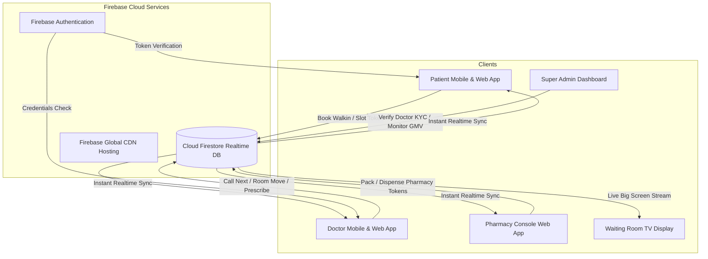

# 🏥 MediQ — Smart OPD Queue Tracker, Healthcare Marketplace & Integrated Pharmacy Ecosystem

> **Next-Generation Real-Time Multi-Hospital OPD Marketplace, Live Queue Tracker, Doctor KYC Workbench & Smart Pharmacy Dispense Engine (Built per PRD v1, v2 & v3 Standards)**

[](https://smart-opd-queue-tracker.web.app)
[](https://flutter.dev)
[](https://reactjs.org)
[](https://firebase.google.com)
[](./LICENSE)

---

## 🌐 Live Production Deployment
* **Live Web Application**: [https://smart-opd-queue-tracker.web.app](https://smart-opd-queue-tracker.web.app)
* **Firebase Project ID**: `smart-opd-queue-tracker`
* **Realtime Sync**: Powered by Cloud Firestore Subscriptions & Firebase Auth

---

## 📱 Mobile Applications (Android Flutter Releases)

The ecosystem includes two high-performance native Flutter Android applications optimized for offline resilience and realtime WebSocket/Firestore listeners:

### 1. 🧑‍🤝‍🧑 **Patient App** (`com.citycare.opd.patient_app`)
* **Dedicated Full-Screen Login**: Instant Google sign-in simulation with custom Gmail account switcher, guest skip mode, and profile sync.
* **Zomato-Style Hospital Discovery**: Browse hospitals with accurate dynamic distances (*CityCare Central 1.2 km, Max Saket 2.1 km, Apollo 3.5 km, Fortis 4.8 km*), ratings, and average wait bands.
* **Symptom Intelligence**: Instant search & filter pills (*Fever / Cold, Chest Pain, Skin Rash, Joint Pain, Pediatrics*).
* **Dual Booking Modes**:
  * ⚡ **Instant Walk-In**: Auto-incrementing token serialization.
  * 📅 **Book OPD Slot**: 15-minute scheduled appointment slots.
* **🚗 Section 7.9: Smart Leave-Now Engine (Reverse ETA Sync)**: Calculates real-time travel time against doctor queue pace and triggers high-visibility alerts so patients travel only when their consultation is approaching.
* **💊 Section 7.10: Pharmacy Dispense Token Tracker**: Real-time dispense status (*Packed & Ready for Pickup / Preparing*) with counter location and prescribed medicines list.
* **🏪 Section 7.11: Nearby Pharmacy Price & Distance Comparison**: Live price benchmark across In-House Pharmacy, Jan Aushadhi (70% Generic Savings), Apollo 24/7, and MedPlus.
* **Digital History & 5-Star Reviews**: Token receipts, doctor notes, and interactive rating submission.

---

### 2. 👨‍⚕️ **Doctor Console & KYC App** (`com.citycare.opd.doctor_app`)
* **Clinician Authentication & Switcher**: Select between approved senior doctors and pending KYC practitioners.
* **Live Queue Management**:
  * **Call Next**: Sequential token calling with pleasant sound chime.
  * **Consultation Stopwatch**: Real-time timer tracking elapsed consultation duration.
  * **Skip & Pause Queue**: Emergency pause / patient delay management.
* **Room & Wing Relocation (Section 7.3)**: Real-time room/floor reallocation with broadcast notifications to patient apps and waiting room TVs.
* **Prescription & Pharmacy Handoff on Complete**:
  * Quick-add medicine chips (*+ Paracetamol 650mg, + Amoxicillin 500mg, + Cetirizine 10mg, + Pantoprazole 40mg, + Azithromycin 500mg, + Cough Syrup*).
  * **Live Nearby Pharmacy Price Analysis**: Shows calculated prescription costs across all 4 partner pharmacies before dispatching.
  * **Dedicated Target Pharmacy Selection**: Generates custom prefix tokens (`PH-XX` for In-House, `JA-XX` for Jan Aushadhi, `AP-XX` for Apollo, `MP-XX` for MedPlus).
  * **⚡ Zero-Waiting Auto-Pack**: If the destination pharmacy has 0 queue ahead, the token automatically transitions to **"Packed & Ready for Pickup"** instantly!
* **Doctor KYC Profile Tab**: View MCI credentials, hospital affiliation, and verification badge.

---

## 💻 Web Application Modules

| Module | URL Path / Component | Description |
| :--- | :--- | :--- |
| **Hospital Discovery** | `HospitalDirectory.jsx` | Multi-hospital directory, symptom smart routing, and distance badges |
| **Patient Live Queue** | `PatientView.jsx` | Live tracker, dynamic room sync, Leave-Now banner, Pharmacy tracker & Price comparison |
| **Doctor Console** | `DoctorDashboard.jsx` | OPD consultation workbench, stopwatch, prescription modal & pharmacy dispatch |
| **Pharmacy Console** | `PharmacyConsole.jsx` | Dedicated dispense counter interface (`PH-XX`, `JA-XX`, etc.) with pack/ready transitions |
| **Waiting Room TV** | `WaitingRoomTV.jsx` | 10-foot widescreen waiting room display for OPD LED screens |
| **Admin Analytics** | `AdminDashboard.jsx` | Hospital-level wait time metrics, consultation throughput, and doctor status |
| **Super Admin GMV** | `SuperAdminDashboard.jsx` | Multi-hospital GMV tracker, revenue metrics, and Doctor KYC verification approval workbench |

---

## 🏗️ System Architecture & Data Flow



---

## ⚡ PRD v3 Core Feature Highlights

### 1. 🚗 Section 7.9: Smart Leave-Now Engine (Reverse ETA Sync)
* Synchronizes patient travel time with doctor consultation throughput.
* When `travelTimeMinutes >= (estimatedWaitMinutes - 5 min buffer)`, an amber/green alert triggers:
  > *"🚗 Leave Now! Traffic: ~14 mins drive. Your Token #04 is 2 patients away."*

### 2. 💊 Section 7.10: Dedicated Pharmacy Selection & Token Handoff
* Doctor selects preferred or generic pharmacy upon consultation completion.
* Issues linked digital token with custom pharmacy prefixes:
  * 🏥 **CityCare In-House Pharmacy**: `PH-01`, `PH-02` (Ground Floor Counter)
  * 🟢 **Pradhan Mantri Jan Aushadhi Kendra**: `JA-01`, `JA-02` (Generic Center)
  * 🏪 **Apollo Pharmacy 24/7**: `AP-01`, `AP-02` (Express Retail)
  * 💊 **MedPlus Pharmacy**: `MP-01`, `MP-02` (Discount Chain)

### 3. ⚡ Zero-Waiting Auto-Pack Feature
* When a pharmacy token is created and the counter queue is empty (0 waiting tokens), the token is **automatically marked as `ready` ("Packed & Ready for Pickup")** with zero delay.

### 4. 🏪 Section 7.11: Real-Time Nearby Pharmacy Price & Distance Comparison
* Analyzes prescribed medicines across 4 local pharmacy options:
  * **Jan Aushadhi Generic**: ~70% cost savings (e.g. ₹54 vs ₹180).
  * **In-House Hospital Counter**: 0 km walk, fastest on-site pickup.
  * **Apollo 24/7**: 0.4 km, round-the-clock emergency stock.
  * **MedPlus**: 1.1 km, 15% branded medicine discounts.

---

## 📂 Codebase Directory Layout

```
OPD/
├── src/                                  # React 19 + Vite Web Application
│   ├── components/                       
│   │   ├── HospitalDirectory.jsx         # Zomato-style Hospital Discovery & Symptom Search
│   │   ├── PatientView.jsx               # Patient Live Tracker, Leave-Now Banner & Pharmacy Card
│   │   ├── DoctorDashboard.jsx           # Doctor OPD Console, Relocation & Prescription Modal
│   │   ├── PharmacyConsole.jsx           # Realtime Pharmacy Dispense Counter Dashboard
│   │   ├── WaitingRoomTV.jsx             # 10-foot Waiting Room TV Display Screen
│   │   ├── AdminDashboard.jsx            # Hospital Operations Analytics
│   │   ├── SuperAdminDashboard.jsx       # Multi-Hospital GMV & Doctor KYC Verification Panel
│   │   ├── HistoryView.jsx               # Patient Visit History & Digital Prescriptions
│   │   ├── AccountView.jsx               # Patient ABDM Profile & Emergency Contacts
│   │   └── Navbar.jsx                    # Top Navigation Bar with Role Switcher
│   ├── context/                          # AuthContext (Google Sign-In & User Session)
│   ├── firebase.js                       # Firebase SDK, Firestore CRUD & Price Comparison Engine
│   ├── App.jsx                           # Route Controller
│   └── index.css                         # Clinical White High-Contrast CSS Design System
│
├── patient_app/                          # Flutter Patient Mobile App
│   ├── lib/
│   │   ├── main.dart                     # 4-Tab Navigation (Discovery, Live Queue, History, Profile)
│   │   └── firebase_options.dart         # FlutterFire Configuration
│   └── pubspec.yaml                      # Flutter dependencies
│
├── doctor_app/                           # Flutter Doctor Mobile App
│   ├── lib/
│   │   ├── main.dart                     # Doctor Console, Live Stopwatch, KYC Tab & Prescription
│   │   └── firebase_options.dart         # FlutterFire Configuration
│   └── pubspec.yaml                      # Flutter dependencies
│
├── firestore.rules                       # Firestore Security Rules
├── firebase.json                         # Firebase Hosting & Deployment Config
└── package.json                          # Web Node Dependencies
```

---

## 🚀 Setup & Execution Guide

### Prerequisites
* **Node.js** (v18.x or higher)
* **Flutter SDK** (v3.19.x or higher)
* **Android SDK & ADB** (for physical device debugging & installation)

---

### 1. Web Portal (Local Development & Hosting)
```bash
# Install dependencies
npm install

# Start local dev server (Vite)
npm run dev

# Build production bundle
npm run build

# Deploy live to Firebase Hosting
npx firebase-tools deploy --only hosting
```

---

### 2. Patient Mobile App (Flutter)
```bash
cd patient_app

# Install packages
flutter pub get

# Run on emulator/connected phone
flutter run

# Compile Release APK
flutter build apk --release
```
* **Release APK Output**: `patient_app/build/app/outputs/flutter-apk/app-release.apk`

---

### 3. Doctor Mobile App (Flutter)
```bash
cd doctor_app

# Install packages
flutter pub get

# Run on emulator/connected phone
flutter run

# Compile Release APK
flutter build apk --release
```
* **Release APK Output**: `doctor_app/build/app/outputs/flutter-apk/app-release.apk`

---

### 4. Direct Android Device Installation (via ADB)
```bash
# Push & install Patient App
adb push patient_app/build/app/outputs/flutter-apk/app-release.apk /data/local/tmp/patient_app.apk ; adb shell pm install -r -d /data/local/tmp/patient_app.apk

# Push & install Doctor App
adb push doctor_app/build/app/outputs/flutter-apk/app-release.apk /data/local/tmp/doctor_app.apk ; adb shell pm install -r -d /data/local/tmp/doctor_app.apk
```

---

## 🎨 Design System Specifications
* **Base Theme**: Pure Clinical White (`#FFFFFF`) with Deep Onyx text (`#090D16`) for maximum medical legibility.
* **Patient Identity**: Sky Blue & Health Cyan (`#0284C7`, `#0EA5E9`).
* **Doctor Identity**: Medical Emerald Teal (`#0D9488`, `#059669`).
* **Pharmacy Identity**: Amber & Dispense Violet (`#D97706`, `#7C3AED`).
* **Typography**: Google Outfit & Inter fonts.
* **Responsive Architecture**: Fluid grid scaling from 360px mobile screens up to 4K waiting room TV monitors.

---

## 🔒 Security & Firestore Rules
All Firestore collections (`doctors`, `hospitals`, `tokens`, `pharmacy_tokens`, `pharmacyCounters`, `history`, `reviews`, `users`) are secured with timestamp validation, atomic transactions, and role integrity in [`firestore.rules`](./firestore.rules).

---

## 📄 License
This project is open-source under the **MIT License**. Engineered for modern hospitals, polyclinics, and OPD healthcare facilities.
